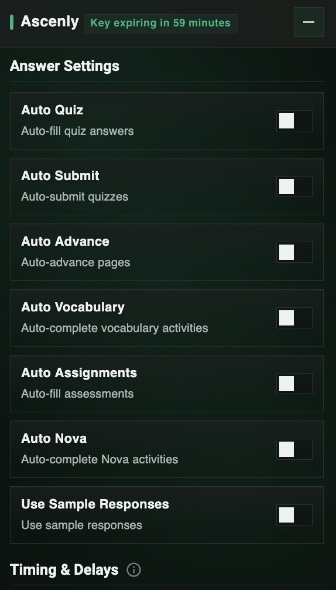

<div align="center">


# ASCENLY

**The only Edgenuity tool you'll ever need**

[](https://discord.gg/edgenuity)
[](https://ascenly.org/)


</div>

Ascenly is a Tampermonkey script that completes your Edgenuity coursework using AI. It answers quizzes, writes essays, skips videos, and advances through activities on its own. You literally just install it and walk away.

---

### Getting started

```
1. Visit ascenly.org and grab the script
2. Install Tampermonkey on Chrome or Firefox
3. Paste the script into Tampermonkey
4. Go to Edgenuity - the Ascenly panel loads automatically
```

Need a hand? The [Discord](https://discord.gg/edgenuity) has setup guides and people who can help.

### What's included

- Auto answers for every question type (multiple choice, matching, fill in the blank, dropdown, you name it)
- Essay and short answer writer powered by AI
- Video skipper so you're not watching 8 hour lectures
- Auto advance to keep moving without clicking next
- Assignment unlocker for locked activities
- Full EdgeEX support for the updated Edgenuity layout

<div align="center">

</div>

---

<div align="center">

**AI answers** · **Can't be detected** · **Starting at $2/day** · **Works on every class**

[ascenly.org](https://ascenly.org/) | [discord.gg/edgenuity](https://discord.gg/edgenuity)

</div>
